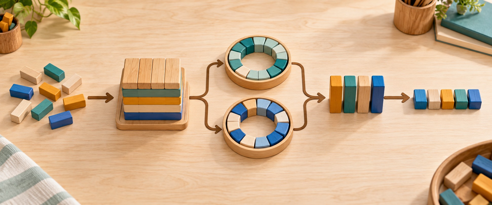
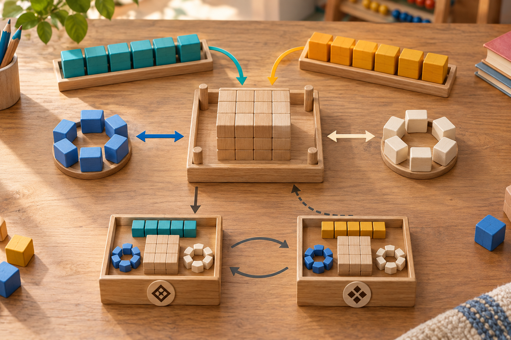
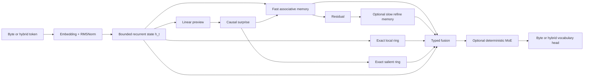
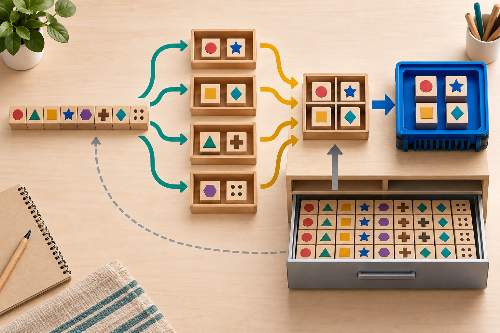

# Koemi-5HOM

**Koemi-5 HERM Optimized Model** is an open-source PyTorch research base
for causal models with bounded recurrent state, hierarchical associative memory,
exact bounded recall, hash or learned MoE routing, typed decision training,
checkpoint integrity, and optional native CUDA operator fronts.

Version 0.5.0 adds an optional learned top-k gate after HERM fusion and a
supervised trainer for the Laya decision architecture. **MDT (Modelo de
Decisão Tipada)** names the typed decision path. DeepGEMM informs the
separation of routing and grouped execution; its SM90/SM100 kernels are not
integrated or claimed to accelerate the A100. See the
[5HOM implementation contract and reference study](docs/KOEMI_5HOM.md).

The source release is MIT-licensed. This repository does not ship trained
weights or a training corpus. Code, weights, datasets, and trademarks are
separate artifacts and must keep their own licensing decision.

- Current version: [`docs/KOEMI_5HOM.md`](docs/KOEMI_5HOM.md)
- MDT training introduction (Portuguese): [`docs/MDT_TRAINING.md`](docs/MDT_TRAINING.md)
- Historical 4HCM dossier: [`docs/KOEMI_4HCM_RELEASE.md`](docs/KOEMI_4HCM_RELEASE.md)
- Architecture: [`docs/KOEMI_ARCHITECTURE.md`](docs/KOEMI_ARCHITECTURE.md)
- Identity and licensing: [`docs/MODEL_IDENTITY_AND_LICENSING.md`](docs/MODEL_IDENTITY_AND_LICENSING.md)
- A100 training: [`docs/A100_SAFE_TRAINING.md`](docs/A100_SAFE_TRAINING.md)
- CUDA and optimization boundary: [`docs/HERM_OPTIMIZATION_LAB.md`](docs/HERM_OPTIMIZATION_LAB.md)
- MoE storage: [`docs/SUBMAPPING_MOE.md`](docs/SUBMAPPING_MOE.md)

## The one-minute explanation

Large attention models repeatedly revisit a growing context. HERM keeps a
fixed-width causal state, learns compressed associations, and retains a small
amount of exact recent or surprising detail. The state does not grow with the
conversation length.

The wooden blocks below are the mental model. They are arithmetic counting
blocks like the ones used to learn multiplication, not a Jenga tower:



1. Small blocks entering from the left are bytes or hybrid-token ids.
2. The center stack is the bounded recurrent state. It is rebuilt every step,
   but its shape stays fixed.
3. The two circular trays are exact local and surprise-admitted memory.
4. The colored vertical blocks are optional deterministic experts.
5. The row on the right is the vocabulary prediction for the next byte/token.

This is an analogy for the data flow, not a claim that the model stores literal
wooden blocks.

## What changed from 3HIP to 4HCM

Koemi-3HIP was the initial HERM implementation. Koemi-4HCM consolidates the
model, runtime, training, artifact identity, storage experiments, and CUDA
fronts into one release boundary.

| Area | 3HIP | 4HCM |
| --- | --- | --- |
| HERM core | Initial bounded recurrent and associative-memory path | Same causal model family documented as one coherent release |
| Artifact identity | No stable public identity contract | `ModelIdentity` with organization, model name, version, custom heading, architecture, variant, and description |
| Licensing | External documentation only | Source, weights, and data availability travel as separate metadata fields |
| Checkpoints | Legacy checkpoint writers and rotating training checkpoints | Immutable `CheckpointCatalog` with payload hashes, retention, and `weights_only=True` recovery; legacy paths remain usable |
| Training | Byte training, thinking masks, deterministic experts | Length-aware batching, A100 safe/aggressive profiles, rotating recovery, answer/thinking metrics, and measured expert occupancy |
| Inference | Recurrent generation and exact prefix reuse | Fast decode, prefill/decode batching, speculative paths, RAM/SSD block reuse, and parameter offload seams |
| Tokenization | Byte-first path | Hybrid byte/BPE vocabulary with migration and span-marker protection |
| MoE | Deterministic content-hash dispatch in the normal model path | Isolated MoE-only Submapping storage fork plus native route/permute/group/combine kernels |
| CUDA | PyTorch CUDA seams without a measured native-kernel record | Four opt-in `.cu` fronts compiled and contract-checked on an A100 |
| Operations | Notebook and local runner paths | Bounded Colab MCP retryer with explicit retry and remote-failure markers |

The consolidation name does not mean every experiment became the default
execution path. The normal runner remains the compatibility and numerical
oracle path.

## What you can do with the repository

| Use case | Available capability | Main entry point |
| --- | --- | --- |
| Train a causal model | Byte-level supervised training, AdamW, warmup/cosine scheduling, AMP, accumulation, validation, thinking loss | `python -m koemi train` |
| Prepare data | Canonical JSON/JSONL plus Alpaca, ShareGPT, and UTF-8 text adapters | `src/koemi/data/` |
| Generate text | Default recurrent decode, fast fixed-shape decode, greedy/sampling, system/user spans | `python -m koemi generate` |
| Reuse exact work | RAM token cache, SSD prefix ledger, block-backed prefix cache | `src/koemi/model/cache.py`, `src/koemi/runtime/` |
| Batch inference | Prefill/decode phases, length buckets, padded batches, request handles and deadlines | `inference_batching.py`, `generation.py` |
| Speculate | N-gram or smaller-model proposal with verification and rejection sampling | `runtime/speculative.py` |
| Reduce residency | Accelerator, host, and disk parameter tiers with measured offload logs | `python -m koemi train --offload-*` |
| Change the vocabulary | Learn a byte/BPE hybrid vocabulary and migrate a byte checkpoint | `build-vocabulary`, `expand-vocabulary` |
| Publish identity | Stable heading, model id, organization, version, and separate license fields | `ModelIdentity` |
| Recover safely | Immutable generations, SHA-256 manifests, corruption rejection, retention | `CheckpointCatalog` |
| Store sparse experts | Validated per-expert blocks, bounded LRU, digest checks, deterministic route | `MoeSubmappingStore` |
| Compile CUDA fronts | Core, dense, think, and MoE native extensions on a CUDA host | `src/koemi/cuda_kernels/` |
| Run A100 training | Preflight, budget ledger, resumable Drive checkpoints, pinned data revisions | `a100_safe_run.py`, `a100_run.py` |

## A second block picture: memory and checkpoints



Read the picture from the middle outward:

- the central stack is the fixed recurrent state;
- the teal tray is fast associative memory;
- the amber tray is the slower residual/refine memory;
- the blue and cream rings are exact bounded recall;
- the two lower boxes are alternating checkpoint generations;
- the arrows mean “write a new state, verify it, and recover the newest valid
  generation”, not “overwrite the only copy”.

## Install

Python 3.11 or newer is required. The package declares `numpy>=2.1` and
`torch>=2.8`.

```bash
git clone https://github.com/Koemi-AI/Koemi-5HOM.git
cd Koemi-5HOM
python -m venv .venv

# Linux/macOS
.venv/bin/python -m pip install --upgrade pip
.venv/bin/python -m pip install -e .

# Windows PowerShell
.venv\Scripts\python.exe -m pip install --upgrade pip
.venv\Scripts\python.exe -m pip install -e .
```

The repository itself has no required CUDA dependency. Native fronts activate
only when the process has CUDA-enabled PyTorch, a compatible device, and a
matching CUDA toolkit with `nvcc`.

## First run: validate, train, generate

Use the canonical example to check the data boundary before training:

```bash
python -m koemi inspect-dataset --dataset examples/canonical.jsonl
```

Train a small checkpoint:

```bash
python -m koemi train \
  --dataset examples/canonical.jsonl \
  --checkpoint artifacts/koemi-4hcm.pt \
  --overwrite \
  --expert-count 2 \
  --thinking-loss-weight 2.0
```

Generate from it:

```bash
python -m koemi generate \
  --checkpoint artifacts/koemi-4hcm.pt \
  --system "Answer in one sentence." \
  --prompt "Explain FIFO." \
  --max-new-bytes 64 \
  --greedy
```

The serialized record boundary protects role spans. Reserved markers such as
`<|system|>`, `<|input|>`, `<|thinking|>`, and `<|output|>` are rejected when
they appear as forged user/data content. `--raw-prompt` is available only for a
checkpoint that was trained without those markers.

## Dataset contract

`inspect-dataset` and `train` accept UTF-8 `.txt`, JSON arrays, and JSONL. Use
`--dataset-format auto|canonical|alpaca|sharegpt` when auto-detection is not
enough. The canonical record has this shape:

```json
{
  "id": "queue-001",
  "system": "Answer in one sentence.",
  "input": "Explain FIFO in one sentence.",
  "thinking": "A queue preserves arrival order.",
  "output": "FIFO means first in, first out.",
  "metadata": {"source": "example"}
}
```

`system` is conditioning context and is not a supervised target. `thinking` is
optional; its bytes receive their own target mask and can receive a separate
loss weight. For plain text, set `output` to `null` and the complete `input`
becomes the causal training sequence. Alpaca and ShareGPT records enter through
validated adapters, and malformed records fail at the data boundary.

## Thinking spans are supervised data

Thinking bytes can have their own mask and loss weight. They are visible
training targets, not a promise of private chain-of-thought behavior.

```bash
python -m koemi train \
  --dataset examples/canonical.jsonl \
  --checkpoint artifacts/koemi-thinking.pt \
  --thinking-loss-weight 2.0 \
  --overwrite

python -m koemi generate \
  --checkpoint artifacts/koemi-thinking.pt \
  --prompt "Work through this carefully." \
  --prompt-target thinking \
  --max-new-bytes 128
```

Every training run reports supervised tokens, thinking tokens, loss, thinking
loss, validation metrics when configured, perplexity, learning rate, optimizer
steps, precision, and tokens per second.

## HERM in plain language and in equations

HERM combines four kinds of memory:

1. a bounded recurrent state `h_t` for the running causal chain;
2. a fast normalized associative memory for repeated patterns;
3. an optional slower memory for reconstruction residuals;
4. exact local and surprise-admitted rings for details that should not be
   compressed immediately.

The causal order is important. The state before the current target is used to
predict that target. The current token is not allowed to leak into its own loss.

The recurrent update is bounded:

```text
a_t = eps + (1 - 2 eps) sigmoid(W_a u_t + b_a)
g_t = (1 - a_t) tanh(W_g u_t + b_g)
h_t = a_t * h_(t-1) + g_t
```

The fast associative memory receives rank-one writes:

```text
B_t = lambda_t * B_(t-1) + w_t * v_t * phi_t^T
c_t = lambda_t * c_(t-1) + w_t * phi_t
```

The read includes a confidence factor. An empty memory returns low evidence
instead of turning division by a small epsilon into a large noise signal.

```text
confidence_t = den_t / (den_t + eps_m)
m_t = confidence_t * (B_(t-1) psi_t / (den_t + eps_m))
```

The parallel path evaluates bounded scan chunks; the sequential path applies the
same equations token by token and remains the numerical oracle. Tests compare
logits, state tensors, and selected gradients across those paths.



## Hash and learned MoE

The regular HERM MoE path is deliberately predictable. A content hash of the
current and previous byte selects `expert_top_k` experts. Position is not part
of the route, so the same bigram receives the same expert set wherever it
appears.

- `--expert-count 0` disables the bank.
- `--expert-top-k 1` preserves the lowest-cost path.
- A `128/6` configuration activates six deterministic experts per valid byte.
- Hash remains the compatibility default. `--expert-routing learned` selects
  a gate trained from the fused causal context, with unique top-k experts and
  selected softmax probabilities weighting the residual update.
- `--expert-load-balance-weight` scales a whole-forward auxiliary loss.
  Logs expose `router_loss` and expert occupancy; validation perplexity
  excludes that auxiliary loss.
- `--expert-dispatch segments` groups token rows by expert for training.
  This is a PyTorch implementation with a CUDA count synchronization, not
  a DeepGEMM kernel or a measured speed improvement.
- Load balance is measured from the run; it is not assumed from the hash.

The native MoE path is inference-only and stricter than the legacy route: it
rejects duplicate valid assignments and never routes padding.

Train the learned route:

```bash
python -m koemi train --dataset examples/canonical.jsonl \
  --checkpoint artifacts/koemi-5hom.pt --expert-count 8 --expert-top-k 2 \
  --expert-routing learned --expert-dispatch segments \
  --expert-load-balance-weight 0.01
```

Learned routing is functional and tested, but semantic specialization and a
quality gain over hash routing require a matched multi-seed comparison.

## MDT: simpler typed decision training

Start with the [MDT training introduction](docs/MDT_TRAINING.md) for dataset
format, checkpoint requirements, training controls and prediction examples.

The optional Laya adapter accepts labeled `state`, `questions`, and `gold`
JSONL rows. It trains option distributions directly with soft cross-entropy
and an ordinal CDF term for scores. It supports encoder freezing, separate
learning rates and accumulation weighted by the number of decisions.
Calibration splits by complete state before training, keeping duplicate states
and their questions together. The exported directory loads in Laya.

```bash
python -m pip install -e ".[decisions]"
python -m koemi.training.laya_decisions \
  --model-directory /path/to/local/laya-checkpoint \
  --dataset examples/typed_decisions.jsonl \
  --output artifacts/laya-supervised --freeze-encoder
```

This command requires a complete local checkpoint and does not fetch weights.
It writes safetensors, tokenizer/encoder config, per-type temperatures and a
training report to a new directory. Existing output directories are refused.
The tiny example checks the pipeline; it is not a useful training corpus.
The act/escalate head is preserved but receives no new supervision; it must
not be used as newly trained correctness confidence.

`koemi.model.decisions.typed_decisions` converts option logits into `choice`,
ordinal expected `score`, or yes-probability `noul` answers without generating
text. `max_probability` describes the option distribution and is not an
epistemic correctness guarantee. The HERM language checkpoint and the Laya
decision checkpoint are separate architectures and artifact formats.

## MoE Submapping: keep the bank in storage, move selected blocks



The third picture shows the intended physical idea:

1. the full expert bank sits in a validated storage layout;
2. content routing selects only the required expert/token pairs;
3. stable permutation groups those pairs by expert;
4. selected blocks move to the compute tray;
5. grouped expert work runs and the results are combined back by token row.

`koemi.runtime.moe_submapping` currently provides the safe artifact/storage
slice, not a production NVMe engine. It writes an immutable manifest, a SHA-256
sidecar, per-expert/per-tensor blocks, shape/dtype metadata, and block digests.
The reader rejects unsafe paths, missing blocks, digest mismatches, unsupported
routing, and malformed tensors. A byte-bounded LRU and bounded prefetch are
available at the storage boundary.

The normal `KoemiModel` runner was intentionally not changed. There is no
verified NVMe prefetch, VRAM staging, asynchronous overlap, or end-to-end MoE
throughput result yet.

## Model identity, custom headings, and licensing

An artifact can identify itself without injecting a system prompt into the token
stream:

```python
from koemi.model.identity import ModelIdentity, ModelLicensing

identity = ModelIdentity(
    organization="Koemi Labs",
    model_name="Koemi-5HOM",
    version="0.5.0",
    heading="Koemi-5HOM by Koemi Labs",
    architecture="HERM",
    licensing=ModelLicensing(
        source_license="MIT",
        source_availability="open",
        weights_availability="unknown",
        data_availability="unknown",
    ),
)

print(identity.model_id)
print(identity.render_header())
```

The metadata is stored beside the payload by `CheckpointStore`,
`CheckpointCatalog`, and the MoE manifest. It does not make generated text say
the name. Reliable self-identification requires training examples and a
behavior evaluation. The example above is a declaration format; each real
weights and data release must select its actual policy.

For a source-only publication, keep weights and data as `closed` or `unknown`.
For an open-weights publication, use `weights_availability="open"` together
with an explicit `weights_license`, for example `"MIT"`. The validator rejects
an open artifact that has no license.

## Checkpoint recovery

The legacy checkpoint path remains supported. New publications can use the
immutable catalog:

```python
from koemi.training.checkpoint_catalog import CheckpointCatalog

catalog = CheckpointCatalog("artifacts/koemi-4hcm-catalog", retention=3)
publication = catalog.publish(
    {"state_dict": model.state_dict()},
    identity=identity,
    metadata={"purpose": "release-candidate"},
)
recovery = catalog.recover_latest()
assert recovery.has_checkpoint
```

Each generation has a manifest, payload size, SHA-256 digest, and
`weights_only=True` validation. Recovery scans valid generations and reports
rejected ones instead of trusting one mutable pointer blindly. Multi-writer
locking, signatures, encryption, and migration of the legacy A100 runner are
still separate work.

## Fast decode, batching, caching, and offload

The default decode path is unchanged. Opt in explicitly when the workload and
checkpoint justify it:

```bash
python -m koemi generate \
  --checkpoint artifacts/koemi-4hcm.pt \
  --prompt "Explain FIFO." \
  --max-new-bytes 256 \
  --fast-decode \
  --greedy

python -m koemi generate \
  --checkpoint artifacts/koemi-4hcm.pt \
  --prompt "Explain FIFO." \
  --max-new-bytes 256 \
  --ngram-draft \
  --draft-length 4 \
  --greedy
```

Available runtime pieces include:

- `BatchDecoder` and `generate_batch` for fixed-shape or batched decode;
- prefill/decode queues with length buckets and padded-token accounting;
- `BulkPrefixCache` for exact complete-token blocks in RAM or SSD;
- exact longest-prefix state reuse, never semantic similarity search;
- n-gram and model drafters with explicit acceptance statistics;
- CUDA graph capture only when shapes, addresses, and device constraints allow;
- accelerator, host, and disk parameter tiers with `offload_plan` logs.

Disk offload trades memory for I/O. Frozen parameters are required for the disk
tier; offloading is a capacity mechanism, not a blanket speed claim.

```bash
python -m koemi train \
  --dataset examples/canonical.jsonl \
  --checkpoint artifacts/koemi-offload.pt \
  --offload-accelerator-mib 512 \
  --offload-host-mib 2048 \
  --overwrite

python -m koemi generate \
  --checkpoint artifacts/koemi-offload.pt \
  --prompt "FIFO means" \
  --offload-accelerator-mib 0 \
  --offload-host-mib 0 \
  --offload-store artifacts/offload-weights
```

## Hybrid tokenizer

The byte path is always available. The hybrid tokenizer keeps byte ids for the
base alphabet, reserves padding and role markers, then learns BPE-style merges
from a corpus. It reduces the number of positions for frequent pieces but
changes the vocabulary head, so it requires migration and further training.

```bash
python -m koemi build-vocabulary \
  --dataset examples/canonical.jsonl \
  --output artifacts/vocabulary.json \
  --vocabulary-size 8192

python -m koemi expand-vocabulary \
  --checkpoint artifacts/koemi-4hcm.pt \
  --vocabulary artifacts/vocabulary.json \
  --output artifacts/koemi-4hcm-hybrid.pt
```

The A100 runner is byte-only because its materialized stream is stored as
`bytes`; hybrid training currently goes through the general CLI trainer.

## Configuration reference

The CLI keeps the byte path as the compatibility default. These are the knobs
that change model shape, memory behavior, batching, or generation cost; run
`python -m koemi train --help` and `python -m koemi generate --help` for the
complete parser surface.

| Option | Default | Effect |
| --- | ---: | --- |
| `--embedding-size` | `64` | Width of embeddings and recurrent state. |
| `--memory-features` | `16` | Feature width of associative memories. |
| `--local-memory-size` | `16` | Exact recent key-value slots. |
| `--salience-memory-size` | `16` | Exact surprise-admitted slots. |
| `--salience-threshold` | `0.75` | Surprise required for salient admission. |
| `--expert-count` | `0` | Expert count; zero disables the bank. |
| `--expert-top-k` | `1` | Experts active per valid token. |
| `--expert-routing` | `hash` | Hash routing or trainable causal `learned` gate. |
| `--expert-dispatch` | `loop` | Reference loop or sorted `segments` training layout. |
| `--expert-load-balance-weight` | `0.01` | Learned gate auxiliary balance weight. |
| `--scan-chunk` | `128` | Sequence window used by the parallel scan. |
| `--refine-decay-rate` | `0.0625` | Timescale of the slower refine memory. |
| `--ablation` | `no_refine` | `herm`, `no_refine`, `no_surprise`, or `affine`. |
| `--execution-mode` | `parallel` | Parallel scan or sequential numerical oracle. |
| `--thinking-loss-weight` | `1.0` | Relative loss weight for thinking bytes. |
| `--max-batch-tokens` | unset | Upper bound on padded tokens per training batch. |
| `--length-bucket-size` | unset | Groups nearby sequence lengths during training. |
| `--precision` | `auto` | FP32 on CPU; BF16/FP16 AMP where supported. |
| `--validation-fraction` | `0.0` | Deterministic record-level validation holdout. |
| `--cache-capacity` | `256` | RAM token-embedding cache capacity. |
| `--mapping-cache` | unset | SSD directory for exact inference state mappings. |
| `--bulk-prefix-cache` | unset | RAM/SSD cache for complete exact-token blocks. |
| `--fast-decode` | off | Fixed-shape decode with fewer host synchronizations. |
| `--cuda-graph` | off | Replays a captured CUDA graph; requires fast decode and CUDA. |
| `--ngram-draft` | off | Proposes repeated-context blocks for verification. |
| `--draft-checkpoint` | unset | Smaller model that proposes speculative blocks. |
| `--offload-accelerator-mib` | unset | Parameter budget resident on the accelerator. |
| `--offload-host-mib` | unset | Parameter budget streamed from host memory. |
| `--offload-store` | unset | Directory for evicted parameter files. |
| `--offload-residency-mib` | `0` | Host read cache in front of the offload store. |

`--mapping-cache` and `--bulk-prefix-cache` are exact byte/token-prefix reuse,
not semantic retrieval. Cache namespaces are required for persistent mappings,
and the two cache implementations cannot be enabled together.

## Native CUDA fronts

The CUDA code is opt-in and isolated under
[`src/koemi/cuda_kernels/`](src/koemi/cuda_kernels/). Conditional contracts are
under [`tests/cuda/`](tests/cuda/). The normal `KoemiModel` path was not changed
to silently select these extensions.

| Front | What it does | Current evidence |
| --- | --- | --- |
| `core` | Fused RMSNorm + SiLU forward/backward | A100 microbenchmark: `0.01280 ms` native vs `0.09078 ms` reference |
| `dense` | Affine scan forward/backward | A100 microbenchmark: `0.06277 ms` native vs `8.47729 ms` sequential reference |
| `think` | Causal surprise forward/backward | Forward `0.04321 ms` vs `0.37970 ms`; backward `0.09400 ms` vs `0.56842 ms` |
| `moe` | Route, stable permutation, grouped expert MLP, combine | Compiled and contract-checked; no end-to-end throughput or backward claim |

The think fast path uses ATen CUDA GEMM, custom warp-shuffle reductions, a
coalesced logits-gradient kernel, GEMMs for parameter gradients, and a bias
reduction. It materializes a float logits matrix, so it is not a standalone
fully fused custom GEMM.

The A100 verification environment was `NVIDIA A100-SXM4-40GB`, compute
capability 8.0, PyTorch `2.11.0+cu128`, and CUDA `12.8`. These are operator
microbenchmarks, not proof of end-to-end training or serving speed.

## A100 training and Colab retrying

There are two bounded training profiles:

- **safe**: approximately `0.205B` parameters, width `512`, 128 experts,
  top-6, 45,000 code-focused records, 25 resumable sessions;
- **aggressive**: approximately `1.035B` parameters, width `1,152`, sequence
  length `512`, 128 experts, top-6, 200,000 bounded records and measured
  microbatch calibration.

Always run plan, preflight, and explicit budget confirmation before a paid run:

```bash
python -m koemi.training.a100_safe_run --mode plan \
  --results-dir /content/drive/MyDrive/koemi-a100-safe-v1

python -m koemi.training.a100_safe_run --mode preflight \
  --results-dir /content/drive/MyDrive/koemi-a100-safe-v1

python -m koemi.training.a100_safe_run --mode train \
  --results-dir /content/drive/MyDrive/koemi-a100-safe-v1 \
  --confirm-budget-hours 188
```

For the aggressive profile, add `--profile aggressive` to all three commands
and use a separate Drive directory. The preflight must report the expected GPU,
finite loss, finite gradients, and a completed optimizer step.

The [`.colab_run_existing.py`](.colab_run_existing.py) harness reconnects a
fresh MCP client after a browser-bridge or runtime transition. Its retry policy
is bounded by:

```text
KOEMI_MCP_RETRIES
KOEMI_MCP_RETRY_DELAY
KOEMI_MCP_RETRY_MAX_DELAY
```

Remote failures are reported as harness failures; they are not silently
classified as a disconnected bridge.

### Training evidence in the supplied log

The supplied aggressive A100 log recorded snapshots from optimizer steps
`18,700` through `18,800`:

| Metric | Observed range | Last snapshot |
| --- | ---: | ---: |
| Tokens seen | `456,175,358` to `458,615,359` | `458,615,359` |
| Loss | `0.5128` to `0.5844` nats | `0.5844` |
| Perplexity | `1.6700` to `1.7939` | `1.7939` |
| Answer BPB | `0.6136` to `0.6580` | `0.6136` |
| Thinking BPB | `1.0821` to `1.1901` | `1.1901` |
| Supervised throughput | `23,484` to `30,211` tokens/s | `30,211` |
| Peak GPU allocation | `33,727,177,216` bytes | `33,727,177,216` |

All 128 experts were occupied in the recorded snapshots. Normalized routing
entropy was `0.9810` to `0.9856`, and load Gini was `0.2068` to `0.2371`.
These numbers describe routing distribution, not semantic expert specialization.
The exported checkpoint named by the log is not independently verified or
shipped by this repository.

## Benchmarks and verification

Run the local suite:

```bash
python -m unittest discover -s tests -p "test*.py"
python -m compileall -q src benchmarks tests
```

Koemi-5HOM verification passed `573` tests, including `25` new routing and
decision-training tests, with `16` conditional CUDA skips. Optional Laya
integration tests were executed with the pinned dependency installed.
The local host is CPU-only, so local tests prove contracts and fallback behavior,
not GPU throughput.

Decode comparison:

```bash
python benchmarks/run_decode_benchmark.py \
  --checkpoint artifacts/koemi-4hcm.pt \
  --device cuda \
  --max-new-tokens 256 \
  --report artifacts/decode.json
```

Model comparison and ablation:

```bash
python benchmarks/run_benchmark.py \
  --task bytes \
  --report artifacts/bench-bytes-koemi-4hcm.json

python benchmarks/run_benchmark.py \
  --task recall \
  --report artifacts/bench-recall-koemi-4hcm.json

python benchmarks/run_ablation.py \
  --task recall \
  --seeds 17 29 41 \
  --train-records 1024 \
  --evaluation-records 1024 \
  --epochs 4 \
  --report artifacts/ablation-recall.json
```

The benchmark harness compares against parameter-matched GRU and LSTM controls.
Small single-seed or overfit runs are schema checks, not evidence of general
model quality.

## What is deliberately not claimed

- Koemi-5HOM is not presented as a Transformer replacement or a quality win.
- Native CUDA fronts are not integrated into the default runner.
- A100 operator speed is not the same as end-to-end model speed.
- The think front is not a fully fused custom GEMM.
- The MoE Submapping slice is not yet a production cube/mmap/NVMe engine.
- MoE native kernels are inference-only and have no backward path yet.
- Proven semantic specialization, distributed training, Triton kernels, semantic
  retrieval, persistent episodic memory, and tool use are outside this release.
- The identity header does not teach a model to say its own name.
- SSD exact-prefix reuse is not semantic retrieval and disk offload is not a
  universal speed optimization.
- The supplied training log does not prove that its exported weights are
  available in this repository.

## Project layout

```text
src/koemi/
  configuration/  model and training settings
  data/           validation, adapters, serialization, byte and hybrid tokenizers
  model/          HERM state, memory, cache, scan, precision, identity and MoE
  cuda_kernels/   isolated native CUDA fronts for core, dense, think and MoE
  runtime/        batching, blocks, prefix cache, offload, decode, serving, Submapping
  training/       datasets, objective, trainer, checkpoints, catalog and A100 runners
benchmarks/       decode, model comparison, dispatch and ablation harnesses
tests/            data, model, runtime, training and conditional CUDA contracts
docs/             architecture, release, training, licensing and optimization notes
notebooks/        legacy 3HIP analysis/T4/A100 Colab paths kept for provenance
assets/           technical diagrams and the 4HCM wooden-block explainers
examples/         canonical JSON and JSONL inputs
```

## License

This source repository is licensed under the [MIT License](LICENSE). The MIT
license applies to the repository code. It does not automatically grant rights
to external training data, third-party datasets, trained weights, or trademarks.
